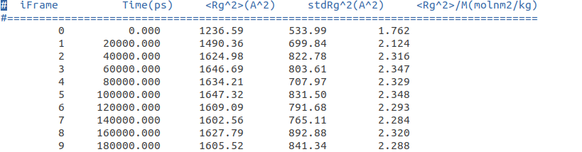
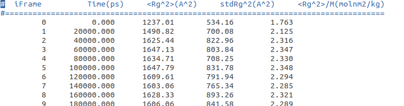

# polymer_size

## **Syntax**

---

```bash
usage: polymer_size.py [-h] -t TRAJ [TRAJ ...] (--topo TPR|DATA|PDB)
                       [--stride STRIDE] [--fraction_trj_avg FRAC_AVG]
                       [--e2e FILE_WITH_DATA_End2EndAtoms] [--e2acf]
                       [--c2n LISTBB] [--log LOG] [-d] [--bondorientation]
                       --unwrap True or False, 1 or 0 [--rg_massw] [--isodf]

Calculate the polymer size (Rg, Ree, ...) from a MD trajectory. This is part
of the polyanagro library

optional arguments:
  -h, --help            show this help message and exit
  -t TRAJ [TRAJ ...], --traj TRAJ [TRAJ ...]
                        A list of trajectories from MD simulations.
  --topo TPR|DATA|PDB   A topology file in tpr, data or pdb format. tpr -->
                        GROMACS, dat --> LAMMPS, pdb --> OTHERS
  --stride STRIDE       Take a frame each stride frames, for example 10
  --fraction_trj_avg FRAC_AVG
                        Fraction of the trajectory to calculate the averages.
                        Example: 0.25 means that the 25% first frames are
                        discarted in the average calculation.
  --e2e FILE_WITH_DATA_End2EndAtoms
                        Calculate the end to end distances using the heads and
                        tails of the chains.The format of the files must be a
                        line for chain: ich ihead itail.The index must start
                        in zero.
  --e2acf               Calculate the end to end autocorrelation function.
  --c2n LISTBB          Data to calculate the Cn of a polymer. The parameter
                        listbb can be either a pdb file template (using the
                        beta field 1:for backbone and 0 for a branch atom) or
                        a file with the following format: i) a label [ mol01
                        ], ii) after a list of the backbone atoms in the
                        mol01. You need as much labels as chains or molecules
                        in your system
  --log LOG             Name of the file to write logs from this command
  -d, --distributions   Calculate Ree and Rg distributions
  --bondorientation     Calculate intermolecular bond orientation
  --unwrap True or False, 1 or 0
                        If True the coordinates are unwrapped
  --rg_massw            Calculate the mass weighted radius of gyration
  --isodf               Calculate 1st and 2nd Legendre polynomials for the
                        correlation between bonds in a polymer chain
```


---

## **Description**

---

The command **polymer_size** calculates some properties of polymers that are related to the size and conformations of the chains. This requires trajectory (**_-t_**) and topology (**_-topo_**) files.

The trajectory formats checked are: XTC, ...

The topology formats checked are: TPR, ...

Since the program relies on the [MDAnalysis](https://www.mdanalysis.org/) library to read and write trajectory and topology files, other formats such as XYZ, DCD, PDB should also work. However, this must be carefully checked.

* **Statistics $<R_g^2>$, $<R_{ee}^2>$, $<R_{ee}^2>$/$<R_{g}^2>$ $<C_n>$**

  Chain statistics can be found in the **pol_size.log** file.


* **Radius of gyration ($\boldsymbol{R_g}$)**

  The $R_g$ is calculated in all cases (see example 1, below). The $R_g$ of a molecule or chain, which is defined as the average squared distance between atoms in a given conformation and the molecule's center of mass, is given by:

  $\large R_{g}^2(ich, N_{at,ich}) = \frac{1}{N_{at,ich}}\sum_{i=1}^{N_{at,ich}} (\vec{r_i}-\vec{r_{cm,ich}})^2$    

  where ${N_{at,ich}}$ is the number of atoms in chain (molecule) ich, 
  
  $\large \vec{r_{cm,ich}} = \frac{ \sum_{i=1}^{N_{at,ich}}m_i\vec{r_i}}{\sum_{i=1}^{N_{at,ich}}m_i}$

  For each time step the average mean-square is given by:
  
    $\large <R_g^2>_=\frac{1}{N_{chains}}\sum_{j=1}^{N_{chains}} R_{g}^2(ich, N_{at,ich})^2$ 

  The calculated data are saved in the file **Rg.dat**. The averages are given in **pol_size.log**
  
  

  :warning: The trajectory must be unwrapped before calculating the $Rg$

* **Mass weighted radius of gyration ($\boldsymbol{R_g}$)**

  The mass weighted $R_g$ can be calculated using the "--rg_massw" option and it is given by:

  $\large R_{g}^2(ich, N_{at,ich}) = \frac{1}{\sum_{i=1}^{N_{at,ich}}m_i}\sum_{i=1}^{N_{at,ich}} m_i(\vec{r_i}-\vec{r_{cm,ich}})^2$    

  This is similar to the $R_g$ calculated by gmx gyrate of GROMACS.

  


    The calculation of this property requires the following options:

   **_"--rg_massw"_**


   The calculated data are saved in the file **Rg_mass.dat** The averages are given in **pol_size.log**
   

* **End-to-end distance ($\boldsymbol{R_{ee}}$) and ratio ($\boldsymbol{<R_{ee}^2>/\boldsymbol<R_{g}^2>}$)**

  The $R_{ee}$ is calculated with the option "--e2e <file_e2e>". For this calculation you need a file with the head and tail atoms for each chain/molecule.

  $\large R_{ee}^2(ich) = (\vec{r_{tail,ich}}-\vec{r_{head,ich}})^2$    

  The format of the <file_e2e> contains one line row chain/molecule. The format of each row is "ich ihead itail", where ich is the number of the chain, ihead and itail are the indexes for the head and tail atoms of the chain, respectively. 
  
  The ratio
  ($\boldsymbol{<R_{ee}^2>/\boldsymbol<R_{g}^2>}$) is also calculated.

  :warning: The indices for both chains and atoms start at zero.

  :warning: The trajectory must be unwrapped before calculating the $Ree$


  ```text
  # ich head tail
  0 0 499
  1 500 999
  2 1000 1499
  3 1500 1999
  (...)
  ```

    The calculation of this property requires the following options:

   **_"--e2e <file_e2e>"_**

  The calculated data are saved in the files **Ree.dat** and **Ree2Rg2.dat**. The averages are given in **pol_size.log**. 
  
* **Mean-squared End-to-end autocorrelation function**

  The chain end-to-end orientational autocorrelation function is given by:

  $<\boldsymbol{\vec{u}(t)}-\boldsymbol{\vec{u}(0)>}$

  where $\boldsymbol{\vec{u}}$ is the unit vector directed along the chain end-to-end vector. 

  The calculation of this property requires the following options:

   **_"--e2e <file_e2e> --e2acf"_**

  The calculated data is saved in the file **rEE_ACF.dat**

* **Mean-squared End-to-end and radius of gyration distributions**

  Mean-squared End-to-end and radius of gyration distributions can be calculated with the option **_"--e2e <file_e2e> --distributions"_**

  The theoretical end-to-end distribution for gaussian chains[^1] is also plotted:

  $\large P({R_{ee}})=4\pi(\frac{3}{2\pi<R_{ee}^2>})^{(3/2)}exp(\frac{-3R_{ee}^2}{2\pi<R_{ee}^2>})R^2$ 

  The calculated data are saved in the files **Ree_distribution.dat** and **Rg_distribution.dat** and **Ree2Rg2_distribution.dat**. 

* **Characteristic ratio $C_n$ and $C_\infin$**

  The characteristic ratio ($C_n$) can be calculated with **polyanagro** program. The value is given by:

  $\large C_n = \frac{<R^2>}{nl^2}$

  $\large C_{\infin} = \lim_{x\to\infin} \frac{<R^2>}{nl^2}$

  The option to use is "**--c2n < LISTBB >**". You need a file containing the backbone atom indices for each chain. The format of this file is as follows: 

  ```text
  [mol0]
  0 1 2 3 4 5 6 7 8 9 10 11 (...) 498 499
  [mol1]
  500 501 502 503 504 (...) 996 997 998 999
  [mol2]
  1000 1001 1002 1003 1004 (...) 1497 1498 1499
  [mol3] 
  1500 1501 1502 1503 1504 1505 1506 1507 15
  (...)
  ```

    :warning: The indices for both chains and atoms start at zero.

  The calculated data are saved in the files **Cn.dat** and **cn_internal_distances.dat**. 


* **Calculating intramolecular bond orientation**

  The option **--isodf** allows to calculate the intramolecular bond correlation. 

  $\large P1(n)=<\vec{u}(0)\vec{u}(n)> = <cos\theta>$

  where $\vec{u}(n)$ is the unit bond orientation of the n bond.

  The option also calculates the 2nd Legendre polynomial:

  $\large P2(n)=1/2<3(\vec{u}(0)\vec{u}(n))^2-1> = 1/2<3cos\theta^2-1>$

  * if $P2(n)$ = 1 --> Parallel
  * if $P2(n)$ = -1/2 --> Orthogonal
  * if $P2(n)$ = 0 --> No correlation

  The option **--isbondorientation** makes the calculation of P1(n)

---

---

## **Examples**

---

* **Calculation of the $<R_g^2>$.**

```bash
polymer_size -t ./01-RESTART-0000-1000ns/traj_comp.xtc ./02-RESTART-1000-2000ns/traj_comp.part0002.xtc ./03-RESTART-2000-3000ns/traj_comp.part0003.xtc --tpr ./01-RESTART-0000-1000ns/topol.tpr --e2e listend2end.dat --c2n backbone_idx.dat --e2acf --distributions --bondorientation --unwrap 1
```
* **Calculation of the mass-weighted $<R_g^2>$.**

```bash
polymer_size -t ./01-RESTART-0000-1000ns/traj_comp.xtc ./02-RESTART-1000-2000ns/traj_comp.part0002.xtc ./03-RESTART-2000-3000ns/traj_comp.part0003.xtc --tpr ./01-RESTART-0000-1000ns/topol.tpr --e2e listend2end.dat --c2n backbone_idx.dat --e2acf --distributions --bondorientation --unwrap 1 --rg_massw
```

* **Calculation of the $<R_{ee}^2>$.**

```bash
polymer_size -t ./01-RESTART-0000-1000ns/traj_comp.xtc ./02-RESTART-1000-2000ns/traj_comp.part0002.xtc ./03-RESTART-2000-3000ns/traj_comp.part0003.xtc --topo ./01-RESTART-0000-1000ns/topol.tpr --unwrap 1 --rg_massw --e2e listend2end.dat
```

* **Calculation of the mean.squared end-to-end ACF.**

```bash
polymer_size -t ./01-RESTART-0000-1000ns/traj_comp.xtc ./02-RESTART-1000-2000ns/traj_comp.part0002.xtc ./03-RESTART-2000-3000ns/traj_comp.part0003.xtc --topo ./01-RESTART-0000-1000ns/topol.tpr --unwrap 1 --rg_massw --e2e listend2end.dat --e2acf
```

* **Calculation of size distributions.**

```bash
polymer_size -t ./01-RESTART-0000-1000ns/traj_comp.xtc ./02-RESTART-1000-2000ns/traj_comp.part0002.xtc ./03-RESTART-2000-3000ns/traj_comp.part0003.xtc --topo ./01-RESTART-0000-1000ns/topol.tpr --unwrap 1 --rg_massw --e2e listend2end.dat --e2acf --distributions
```

* **Calculation of characteristic ratio.**

```bash
polymer_size -t ./01-RESTART-0000-1000ns/traj_comp.xtc ./02-RESTART-1000-2000ns/traj_comp.part0002.xtc ./03-RESTART-2000-3000ns/traj_comp.part0003.xtc --topo ./01-RESTART-0000-1000ns/topol.tpr --unwrap 1 --rg_massw --e2e listend2end.dat --e2acf --distributions --c2n backbone_idx.dat
```

* **Bond orientation calculation.**

```bash
polymer_size -t ./01-RESTART-0000-1000ns/traj_comp.xtc ./02-RESTART-1000-2000ns/traj_comp.part0002.xtc ./03-RESTART-2000-3000ns/traj_comp.part0003.xtc --topo ./01-RESTART-0000-1000ns/topol.tpr --unwrap 1 --rg_massw --e2e listend2end.dat --e2acf --distributions --c2n backbone_idx.dat --bondorientation
```

* **Intramolecular bond orientation.**

```bash
polymer_size -t ./01-RESTART-0000-1000ns/traj_comp.xtc ./02-RESTART-1000-2000ns/traj_comp.part0002.xtc ./03-RESTART-2000-3000ns/traj_comp.part0003.xtc --topo ./01-RESTART-0000-1000ns/topol.tpr --unwrap 1 --rg_massw --e2e listend2end.dat --e2acf --distributions --c2n backbone_idx.dat --bondorientation --isodf
```


[^1]: Polymer physics / Michael Rubinstein and Ralph H. Colby.
Rubinstein, Michael, 1956 December 20-; Colby, Ralph H.
[2007], Pag. 70.